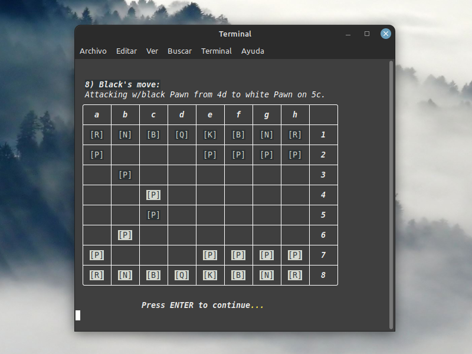

# chess_in_terminal
**✨✨ Work in progress ✨✨**

## A simple chess game to play from the terminal console.

### Description:
I needed to refresh my Python knowledge.
And what better than making a chess game... to play from the terminal console? 😁

Yes, made in Python and only using Numpy and Rich as third-party libraries (the only dependencies needed to run the script).

### Installation:
1) If you don't already have it, install the latest version of Python from the [oficial website](https://www.python.org/downloads/).

2) Download this repository:
    - If you like to use the terminal console:

        `git clone https://github.com/FedeHC/chess-on-terminal.git`

    - Or just download the zip file from the current repository and unzip it in any folder.

3) Use a virtual enviroment (like [Virtualenv](https://virtualenv.pypa.io/en/stable/index.html)) and install dependencies in cloned/unziped folder:

    a) Install:

    `> pip install venv`

    b) Create virtual enviroment:

    `> virtualenv chess`

    c) Activate enviroment:

    `(chess)> source bin/activate`

    d) Install dependencies:

    `(chess)> pip install -r requirements.txt`

### Run:
- Run the [chess_on_terminal.py](chess_on_terminal.py) file:

    `(chess)> python3 chess_on_terminal.py`

And that's it. 😃